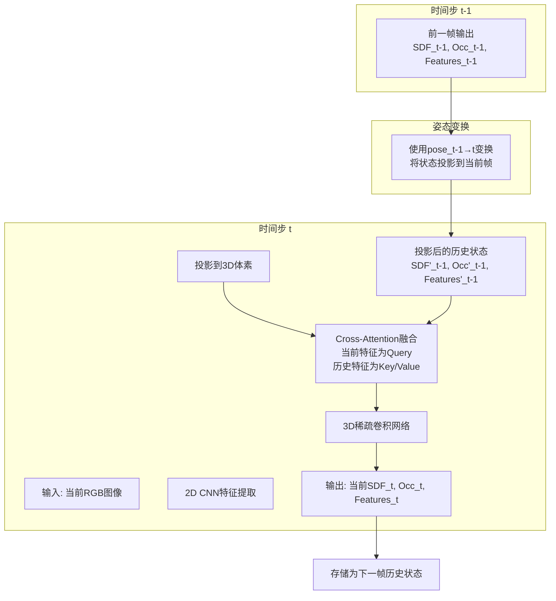

# 流式SDFFormer实施计划

## 项目概述
将现有的多图像推理SDFFormer改为流式推理网络，每次基于历史状态（SDF、占用、特征）和当前单张图像，输出当前的SDF和占用。

## 核心需求
1. **流式推理**：每次只处理一张图像，基于历史状态进行增量更新
2. **历史状态**：包含前一帧的SDF值、占用概率、体素特征
3. **姿态投影**：将历史状态通过相机姿态变换投影到当前帧坐标系
4. **融合机制**：使用Cross-Attention融合当前特征和历史特征
5. **训练目标**：在2张1080Ti（各10GB）上实现batch size 16训练
6. **代码质量**：每个实施阶段完成后添加单元测试，确保代码能正常执行

## 架构设计

### 整体流程图


### 组件设计

#### 1. 姿态投影模块（更新实现方案）
**功能**：将历史状态（SDF、占用、特征）从历史坐标系变换到当前坐标系
**实现方案**：
- 使用pose计算历史状态和当前状态的3D位置映射表
- 使用`torch.grid_sample`进行可微分的特征搬运
- 支持三线性插值，保持梯度流动

**实现细节**：
```python
def project_state(historical_state, historical_pose, current_pose, current_voxel_grid):
    """
    historical_state: 字典包含特征、SDF、占用
    historical_pose: [4, 4] 历史相机到世界变换
    current_pose: [4, 4] 当前相机到世界变换
    current_voxel_grid: 当前体素网格定义
    
    返回：投影到当前坐标系的历史状态
    """
    # 1. 计算变换矩阵：历史体素坐标 → 当前体素坐标
    # 2. 为每个当前体素坐标计算对应的历史坐标
    # 3. 使用grid_sample进行特征插值
    # 4. 返回投影后的特征、SDF、占用
```

#### 2. Cross-Attention融合模块 (`stream_fusion.py`)
**功能**：融合当前特征和投影后的历史特征
**设计**：
- 当前特征作为query，历史特征作为key和value
- 使用局部注意力和分层注意力机制
- 添加历史feature和当前图像feature的关联信息

```python
class StreamCrossAttention(nn.Module):
    def __init__(self, feature_dim, num_heads=8, local_radius=3, hierarchical=True):
        super().__init__()
        self.local_radius = local_radius
        self.hierarchical = hierarchical
        
        # 局部注意力：仅考虑空间邻近的体素
        self.local_attention = LocalCrossAttention(feature_dim, num_heads, local_radius)
        
        # 分层注意力：在不同分辨率上计算
        if hierarchical:
            self.hierarchical_attention = HierarchicalAttention(feature_dim)
            
    def forward(self, current_feats, historical_feats, 
                current_coords, historical_coords, img_feats=None):
        # 局部注意力：历史特征与当前特征的关联
        local_output = self.local_attention(
            current_feats, historical_feats, current_coords, historical_coords
        )
        
        # 如果提供图像特征，添加图像-体素关联
        if img_feats is not None:
            img_association = self.compute_image_association(img_feats, current_feats)
            local_output = local_output + img_association
            
        # 分层注意力（可选）
        if self.hierarchical:
            hierarchical_output = self.hierarchical_attention(local_output)
            return hierarchical_output
            
        return local_output
```

#### 3. 流式SDFFormer (`stream_sdfformer.py`)
**继承**：基于现有的`SDFFormer`类
**新增方法**：
- `project_state()`: 姿态投影（使用grid_sample实现）
- `forward_stream()`: 流式前向传播
- `init_state()`: 初始化状态
- `update_state()`: 状态更新

**状态结构**：
```python
state = {
    'features': torch.Tensor,  # 体素特征 [N, C]
    'sdf': torch.Tensor,       # SDF值 [N, 1]
    'occ': torch.Tensor,       # 占用概率 [N, 1]
    'coords': torch.Tensor,    # 体素坐标（世界系）[N, 3]
    'pose': torch.Tensor       # 相机姿态 [4, 4]
}
```

#### 4. 流式数据集 (`stream_dataset.py`)
**功能**：按时间顺序提供图像序列
**每帧返回**：
- RGB图像 [H, W, 3]
- 深度图像 [H, W]（可选，用于监督）
- 当前相机姿态 [4, 4]
- 前一帧相机姿态 [4, 4]（用于投影）
- 序列ID和时间戳

**数据组织**：
```
scene_001/
  frame_0000/
    color.png
    depth.png
    pose.txt
  frame_0001/
  ...
```

#### 5. 训练脚本 (`train_stream.py`)
**关键特性**：
- 按序列训练，但每次只处理当前帧和前一帧状态
- 教师强制：使用真实历史状态（ground truth）训练
- 损失函数：每个时间步的SDF L1损失 + 占用BCE损失
- 优化器：Adam，与原始SDFFormer相同设置

**训练循环伪代码**：
```python
for sequence in dataloader:
    state = None  # 初始化状态
    for t in range(sequence_length):
        # 获取当前帧数据
        rgb, depth, pose, prev_pose = sequence[t]
        
        # 前向传播（只使用当前图像和前一帧状态）
        output, state = model.forward_stream(rgb, pose, state)
        
        # 计算损失
        loss = sdf_loss(output.sdf, gt_sdf) + occ_loss(output.occ, gt_occ)
        
        # 反向传播（累积梯度）
        loss.backward()
    
    # 参数更新
    optimizer.step()
    optimizer.zero_grad()
```

#### 6. 推理脚本 (`inference_stream.py`)
**功能**：在线处理图像流
**特性**：
- 维护当前状态
- 支持从任意点开始
- 实时输出重建结果
- 可配置的更新频率

## 实施步骤（包含单元测试）

### 阶段1：基础架构（第1周）
1. **创建姿态投影模块**
   - 实现基于grid_sample的投影
   - 处理坐标映射和插值
   - **单元测试**：测试投影的准确性和可微分性
     - 测试简单平移变换
     - 测试旋转变换
     - 测试梯度反向传播

2. **创建Cross-Attention融合模块**
   - 实现局部注意力机制
   - 添加分层注意力（可选）
   - **单元测试**：测试注意力机制的正确性
     - 测试局部注意力范围
     - 测试注意力权重计算
     - 测试前向/反向传播

3. **创建流式SDFFormer骨架**
   - 继承现有SDFFormer
   - 添加状态管理和投影
   - 实现基础前向传播
   - **单元测试**：测试流式前向传播
     - 测试状态初始化
     - 测试单帧推理
     - 测试多帧序列推理

### 阶段2：训练流程（第2周）
1. **创建流式数据集**
   - 支持TartanAir/ScanNet序列
   - 实现数据加载和预处理
   - 数据增强（随机裁剪、旋转）
   - **单元测试**：测试数据集功能
     - 测试数据加载正确性
     - 测试序列顺序
     - 测试数据增强

2. **创建训练脚本**
   - 实现序列训练循环
   - 添加损失计算
   - 配置优化器和学习率调度
   - **单元测试**：测试训练流程
     - 测试单步训练
     - 测试损失计算
     - 测试优化器更新

3. **初始训练和调试**
   - 在小数据集上训练（1-2个序列）
   - 调试内存问题
   - 验证前向/反向传播
   - **集成测试**：端到端训练测试
     - 测试完整训练循环
     - 测试模型保存/加载
     - 测试验证集评估

### 阶段3：优化和评估（第3周）
1. **性能优化**
   - 内存优化（利用流式特性减少显存）
   - 速度优化（局部注意力、稀疏操作）
   - 批量训练优化
   - **性能测试**：测试优化效果
     - 测试内存使用
     - 测试训练速度
     - 测试batch size可扩展性

2. **完整训练**
   - 在全数据集上训练
   - 调整超参数
   - 监控训练指标
   - **验证测试**：测试模型性能
     - 测试重建质量
     - 测试泛化能力
     - 测试不同序列长度

3. **评估和测试**
   - 创建评估脚本
   - 与原始多图像版本比较
   - 测试在线推理性能
   - **系统测试**：完整系统验证
     - 测试端到端推理流程
     - 测试实时性能
     - 测试与基线对比

## 单元测试策略

### 测试框架
- 使用`pytest`作为测试框架
- 使用`torch.testing`进行张量比较
- 创建测试数据工厂生成模拟数据

### 测试目录结构
```
tests/
├── unit/
│   ├── test_pose_projection.py
│   ├── test_stream_fusion.py
│   ├── test_stream_sdfformer.py
│   └── test_stream_dataset.py
├── integration/
│   ├── test_training.py
│   └── test_inference.py
└── conftest.py  # 测试配置和fixture
```

### 关键测试用例
1. **姿态投影测试**：
   - 测试恒等变换（pose相同）
   - 测试简单平移
   - 测试旋转变换
   - 测试梯度存在性

2. **注意力机制测试**：
   - 测试局部注意力范围限制
   - 测试注意力权重归一化
   - 测试分层注意力输出维度

3. **流式推理测试**：
   - 测试状态初始化
   - 测试单帧到多帧扩展
   - 测试状态更新正确性

4. **训练流程测试**：
   - 测试损失下降趋势
   - 测试梯度非零
   - 测试模型保存/加载

## 关键技术挑战与解决方案（更新版）

### 挑战1：姿态投影的坐标对齐
**问题**：体素是离散网格，投影后坐标可能不对齐
**解决方案**：
- **使用torch.grid_sample进行特征搬运**：计算历史状态和当前状态的3D位置映射表，用grid_sample搬运对应状态
- **可微分插值**：支持三线性插值，保持梯度流动
- **高效实现**：批量处理，利用GPU并行计算

### 挑战2：Cross-Attention的计算效率
**问题**：体素数量大（~10^5），全局注意力计算昂贵
**解决方案**：
- **局部注意力**：仅考虑空间邻近的体素（半径内），减少计算复杂度
- **分层注意力**：在不同分辨率上计算，粗到细的策略
- **历史-图像特征关联**：利用历史feature和当前图像feature的关联信息，指导注意力计算

### 挑战3：训练稳定性
**问题**：错误累积、梯度爆炸/消失
**解决方案**：
- **教师强制**：使用真实历史状态（ground truth）训练，减少错误累积
- **梯度裁剪**：限制梯度范围，防止梯度爆炸
- **课程学习**：从短序列开始，逐渐增加序列长度

### 挑战4：内存限制
**问题**：在2×1080Ti上实现batch size 16
**解决方案**：
- **流式优势**：每次只推理当前图像和前一帧的历史状态，不需要保留历史图像原始信息，显存开销比原始代码小很多
- **状态压缩**：历史状态只包含必要的特征，不存储中间计算结果
- **梯度检查点**：选择性使用，进一步减少内存
- **混合精度训练**：使用AMP减少显存使用

## 内存分析（更新）

### 原始SDFFormer内存使用：
- 输入：20张图像 × batch size 2 ≈ 8GB显存
- 同时处理多张图像，需要存储所有中间特征

### 流式SDFFormer内存优势：
1. **单图像输入**：每次只处理一张图像，减少2D特征内存
2. **状态精简**：历史状态只包含体素级特征，不包含图像级中间结果
3. **无序列展开**：训练时不需要同时存储多个时间步的梯度图
4. **增量更新**：状态在时间步间传递，不重复计算

### 预期内存使用：
- **Batch size 16**：每张图像处理开销约为原始版本的1/10
- **总内存**：预计每卡<7GB，留有优化空间

## 文件结构
```
former3d/
├── stream_sdfformer.py      # 流式SDFFormer主类
├── stream_fusion.py         # Cross-Attention融合模块
├── stream_dataset.py        # 流式数据集
├── pose_projection.py       # 姿态投影工具（基于grid_sample）
└── streaming_utils.py       # 流式工具函数

scripts/
├── train_stream.py          # 训练脚本
├── inference_stream.py      # 推理脚本
└── evaluate_stream.py       # 评估脚本

tests/                       # 单元测试目录
├── unit/
├── integration/
└── conftest.py

config/
├── config_stream.yml        # 流式版本配置
└── config_stream_test.yml   # 测试配置
```

## 配置参数
```yaml
# config_stream.yml
stream:
  feature_dim: 128           # 特征维度
  num_attention_heads: 8     # 注意力头数
  local_attention_radius: 3  # 局部注意力半径（体素单位）
  use_hierarchical_attention: true  # 使用分层注意力
  use_teacher_forcing: true  # 使用教师强制
  teacher_forcing_prob: 0.8  # 教师强制概率
  
training:
  batch_size: 16             # 批量大小（可达到）
  sequence_length: 20        # 序列长度
  num_epochs: 100
  learning_rate: 0.001
  gradient_clip: 1.0
  
data:
  dataset: "tartanair"       # 或 "scannet"
  frame_skip: 1              # 帧跳过间隔
  image_size: [480, 640]     # 图像尺寸
  
testing:
  unit_test: true            # 启用单元测试
  integration_test: true     # 启用集成测试
  test_batch_size: 2         # 测试用batch size
```

## 性能目标与评估

### 训练性能
- **目标**：在2×1080Ti（各10GB）上实现batch size 16训练
- **预期内存使用**：每卡<7GB（得益于流式设计）
- **训练速度**：>2 iteration/秒（比原始版本快）

### 重建质量指标
1. **几何精度**：Chamfer Distance, F-score
2. **占用预测精度**：IoU, Precision, Recall
3. **时间一致性**：相邻帧重建差异
4. **增量重建质量**：随着帧数增加，重建质量提升曲线

### 与基线比较
- **基线**：原始多图像SDFFormer（20张图像）
- **比较指标**：
  - 重建质量（流式单帧 vs 多帧批处理）
  - 推理速度（帧率）
  - 内存使用（训练和推理）
  - 时间一致性

## 风险评估与缓解

### 风险1：投影精度不足
- **概率**：中等
- **影响**：高
- **缓解措施**：
  - 实现多种插值方法（最近邻、三线性）
  - 添加投影误差监控
  - 使用更精细的体素网格
  - **通过单元测试验证投影精度**

### 风险2：注意力机制效果不佳
- **概率**：中等
- **影响**：中
- **缓解措施**：
  - 实现可配置的注意力机制（局部/全局/分层）
  - 添加注意力可视化，调试关联性
  - 使用预训练的特征提取器
  - **通过单元测试验证注意力计算正确性**

### 风险3：训练不收敛
- **概率**：低
- **影响**：高
- **缓解措施**：
  - 使用预训练权重初始化
  - 从小学习率开始，逐步增加
  - 添加更多的监控和日志
  - **通过集成测试验证训练流程**

### 风险4：单元测试覆盖不足
- **概率**：低
- **影响**：中
- **缓解措施**：
  - 制定详细的测试计划
  - 使用代码覆盖率工具（如coverage.py）
  - 定期运行测试套件

## 成功标准
1. **功能正确**：能够按序列处理图像并输出合理的3D重建
2. **训练稳定**：损失收敛，无梯度爆炸/消失
3. **性能达标**：在目标硬件上实现batch size 16训练
4. **质量可比**：重建质量接近原始多图像版本（单帧情况下）
5. **内存优势**：显存使用明显低于原始版本
6. **测试完备**：所有核心功能都有单元测试，测试通过率>90%

## 下一步行动
1. **用户确认计划**：获取对更新后计划的最终批准
2. **切换到代码模式**：开始实施阶段1（包含单元测试）
3. **定期检查点**：每周评估进度并调整计划

---
*文档版本：3.0*
*最后更新：2026年1月18日*
*更新内容：添加单元测试要求，完善测试策略*
*作者：Roo（架构师模式）*